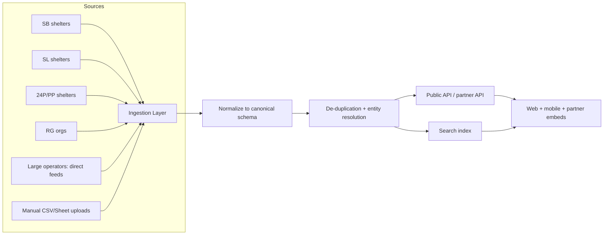
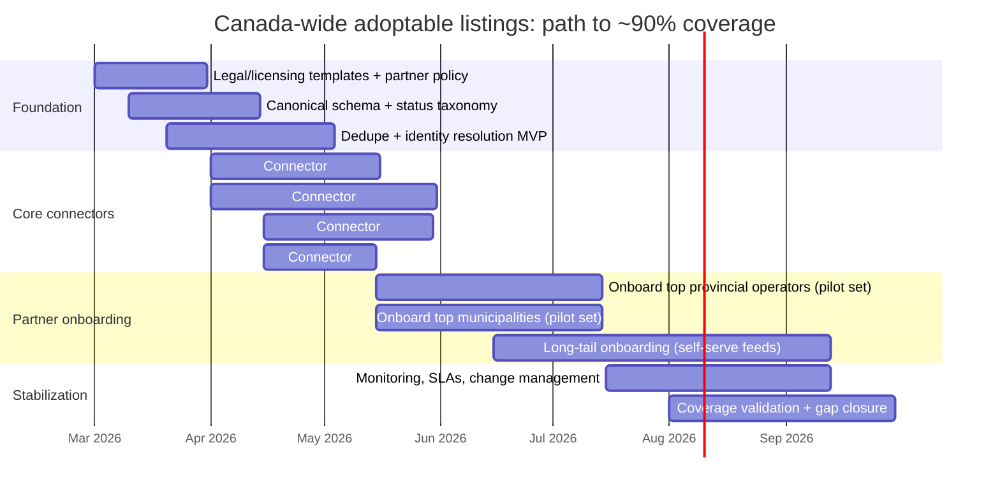

# Canada-specific adoptable‑pet listing infrastructure

## Executive summary

A single, Canada-run “national adoptable‑pet index” with broad, multi‑province coverage (including major metro areas) is not evident in the current Canadian welfare ecosystem; instead, discovery is fragmented across (a) provincial/municipal shelter websites and networks and (b) a small set of North American private aggregators and vendor-hosted listing surfaces. citeturn24search2turn24search17turn30view0turn29view0

Canada does have a national federation for humane societies and SPCAs—entity["organization","Humane Canada","national federation, canada"]—but its public “adopt” presence is best characterized as a campaign/directory pointing users to member shelters, not a unified, pet-level search index with standardized feeds across provinces. citeturn24search2turn22search14turn30view0

In practice, broad cross‑province consumer search is dominated by private aggregators—especially entity["company","Petfinder","pet adoption platform"] and entity["company","Adopt a Pet","pet adoption platform"]—with demonstrable Canadian participation, but (critically) programmatic access is unstable: Petfinder’s public API has been reported (in Petfinder’s own help-center snippets and subsequent ecosystem discussions) as decommissioned after 2025‑12‑02, shifting many integrations away from an API-first model. citeturn24search5turn24search30turn19search0turn19search1turn19search3turn19search9

Listing data flows in Canada are largely vendor-mediated: shelters publish adoptable animals through shelter management systems and embedded listing widgets/portals (e.g., entity["company","ShelterBuddy","animal shelter software"], entity["company","ShelterLuv","animal shelter software"], entity["organization","RescueGroups.org","nonprofit pet tech"], and the entity["company","24Petconnect","pet adoption and lost pets"] / “Petango” web services orbit), then optionally syndicate to third-party marketplaces. citeturn23search1turn23search14turn4search3turn3search2turn21search7turn4search6turn4search17

The strongest path to ~90% Canada-wide listing coverage (assuming no existing national index) is a hybrid: (1) partner/ingest from the largest multi-location shelter operators in each province and key municipal animal services, and (2) build connectors for the dominant vendor stacks present in Canada (ShelterBuddy, PetPoint/24Petconnect/Petango, ShelterLuv, and RescueGroups), while (3) offering a low-friction “manual feed” onboarding option for the long tail of independent rescues. citeturn30view1turn23search1turn25search17turn4search9turn3search2turn23search14turn21search7

## National versus provincial landscape

### What “broad coverage” implies in Canada
For this report, “broad” means multi-province coverage that includes major Canadian urban centers (e.g., entity["city","Toronto","Ontario, Canada"], entity["city","Montréal","Quebec, Canada"], entity["city","Vancouver","British Columbia, Canada"], entity["city","Calgary","Alberta, Canada"], and similar metros), and includes both animal shelter operators and rescue/foster networks. citeturn24search0turn28search25turn23search3turn28search6turn22search21

### Finding on a “national Canadian adoptable‑pet index”
No single, Canada-administered pet-level index with standardized ingestion across provinces is clearly identifiable from primary sources reviewed. Instead:
- A national federation (Humane Canada) exists and runs adoption promotion/directory pages that refer adopters to member shelters, but it does not present itself as a unified national pet listing index. citeturn24search2turn22search14turn30view0  
- Humane Canada’s sector reporting explicitly notes that there are “no compiled statistics elsewhere” covering all animal shelters, underscoring broader fragmentation and the lack of a single canonical national dataset—even for shelter statistics, let alone live adoptable inventories. citeturn30view0turn29view0

### Cross‑province aggregators with Canadian presence

The strongest “national-scale” discoverability for adopters is provided by a small set of private platforms and vendor-hosted portals, not by a Canadian public index:

| Channel | What it is | Canadian presence evidence | Programmatic access notes |
|---|---|---|---|
| PF = Petfinder | Consumer aggregator / search across a large network of shelters/rescues | Petfinder is described as having “over 600 active groups in Canada” (corporate owner content) and is used by Canadian municipal pages (e.g., Vancouver’s adoptable listings indicate “Powered by Petfinder”). citeturn24search5turn28search6 | Petfinder help-center snippets report the Petfinder API “decommissioned after 12/2/2025,” implying diminished/changed public API availability. citeturn19search0turn19search1turn19search3 |
| AAP = Adopt a Pet | Consumer aggregator; claims U.S. + Canada coverage | Adopt a Pet states it partners with shelters and rescues “across the U.S. and Canada.” citeturn24search30 | Organization-facing terms explicitly mention “application programming interfaces,” implying some API surface exists by agreement. citeturn14search6 |
| 24P = 24Petconnect / Petango web services | Vendor-hosted public listing surfaces used by shelters; Petango has been migrated into 24Petconnect | Petango redirect indicates migration to 24Petconnect; Petango web services expose “AdoptableSearch/AdoptableDetails” operations (SOAP endpoint), widely embedded by shelters. citeturn4search6turn4search17 | Access commonly works via “authkey/site” parameters (implementation varies by shelter); typically requires permission/contractual clarity for reuse. citeturn4search1turn4search17 |
| SB = ShelterBuddy portals + API | Shelter management system with hosted “public adoptable search” sites and an API | Regina Humane Society publishes adoptables on a ShelterBuddy-hosted portal; ShelterBuddy provides API documentation. citeturn23search1turn4search3 | API is described as designed for caching to local DB—not direct website querying—suggesting ingestion pattern is “pull then cache.” citeturn4search3 |
| SL = ShelterLuv | Shelter software used by some Canadian SPCAs/humane societies | Saskatoon SPCA states its adoptable lists “update in real time through ShelterLuv.” citeturn23search14turn23search22 | ShelterLuv provides API key workflows (example: API instructions used for automated reporting integrations). citeturn3search1turn3search16 |
| RG = RescueGroups.org | Nonprofit data management + syndication; offers adoptable pet data APIs | RescueGroups offers an “Adoptable Pet Data API” and lists Petfinder + Adopt‑a‑Pet among destinations using its data; Canadian rescue websites appear to run on RescueGroups-hosted pages. citeturn3search2turn21search7turn21search2 | Provides HTTP/JSON and REST API forms (by arrangement) suitable for direct ingestion. citeturn3search10turn3search13 |
| PSCC = PetSmart Charities of Canada (network channel) | In-store adoption partnership network (not a unified online listing API) | PetSmart Charities of Canada describes nationwide in-store adoption events and partnerships that bring adoptable pets into “nearly every” PetSmart store; a large partnership surface for outreach/onboarding rather than a canonical listing feed. citeturn24search1turn24search23 |

**Interpretation:** If “national index” is defined as a Canada-run pet-level registry, the answer is “no clear evidence.” If defined as any single search surface with broad Canadian coverage, PF and AAP function that way for adopters, but coverage is gated by participation and, for PF, API access appears to have changed materially after late 2025. citeturn24search5turn24search30turn19search0turn19search1turn19search3

## Province-by-province key channels

**How to read the tables**
- “Major channels (codes)” uses the national codes above.
- “APIs/formats” describes likely integration primitives (hosted portal, REST/JSON, SOAP, embedded widget, or partner-specific feed). This is a synthesis of what Canadian shelters publicly expose; where a shelter’s back-end vendor is not stated, it is marked “unspecified.” citeturn4search3turn4search17turn3search2turn23search14turn28search6  
- “Estimated coverage” is qualitative and refers to potential coverage if you integrate the named channels/operators; it is not a measured national statistic because a canonical census of all Canadian rescues and municipal shelters is not available from reviewed primary sources. citeturn30view0turn29view0

### BC
| Major shelters/networks (examples) | Major channels (codes) | APIs/formats you’re likely to encounter | Estimated coverage | Key evidence |
|---|---|---|---|---|
| entity["organization","BC SPCA","animal welfare, bc, ca"] (provincewide operator) | PF (optional), plus first-party portal | First-party adoption portal (web search by city/postal code). citeturn22search0 | High for BC SPCA-operated inventory; moderate overall due to independent rescues + municipal shelter listings | BC SPCA provides a dedicated adoption portal/search. citeturn22search0turn22search20 |
| entity["organization","City of Vancouver Animal Shelter","vancouver, bc, ca"] | PF | Municipal adoptable listings explicitly state “Powered by Petfinder.” citeturn28search6 | Medium in Metro Vancouver municipal flow; complements BC SPCA | Vancouver’s adoptable page: “Powered by Petfinder.” citeturn28search6turn28search2 |

### AB
| Major shelters/networks (examples) | Major channels (codes) | APIs/formats you’re likely to encounter | Estimated coverage | Key evidence |
|---|---|---|---|---|
| entity["organization","Calgary Humane Society","calgary, ab, ca"] | First-party site; PF/AAP optional | First-party online listing pages by species/category. citeturn22search1turn22search17 | High in Calgary region; moderate provincial | Calgary Humane lists adoptables online with dedicated listing pages. citeturn22search1turn22search17 |
| entity["organization","Edmonton Humane Society","edmonton, ab, ca"] | First-party site; PF/AAP optional | First-party “Adoptable Animals” listing. citeturn22search2 | High in Edmonton region; moderate provincial | EHS publishes an “Adoptable Animals” page. citeturn22search2turn22search10 |
| entity["organization","City of Calgary","calgary, ab, ca"] (municipal adoption partners) | Directory-style partner routing | Municipal page routes adopters to partner orgs (not a unified inventory feed). citeturn22search21 | Improves discovery of key partners rather than adding a feed | City of Calgary lists adoption partners and links out. citeturn22search21 |
| entity["organization","City of Edmonton Animal Care & Control Centre","edmonton, ab, ca"] | Transfer-to-shelter flow | Municipal flow transfers adoptables to EHS and others, affecting where inventory “lives.” citeturn22search25 | Important for understanding dedupe/transfer events | Edmonton notes adoptables transferred to EHS/rescues. citeturn22search25 |

### SK
| Major shelters/networks (examples) | Major channels (codes) | APIs/formats you’re likely to encounter | Estimated coverage | Key evidence |
|---|---|---|---|---|
| entity["organization","Regina Humane Society","regina, sk, ca"] | SB | ShelterBuddy-hosted adoptable search portal. citeturn23search1 | High for Regina region; “SB connector” scales to other SB users | RHS adoptables are served from a ShelterBuddy domain. citeturn23search1turn23search9 |
| entity["organization","Saskatoon SPCA","saskatoon, sk, ca"] | SL; PF (optional) | Public pages state listings update via ShelterLuv; also has Petfinder member presence. citeturn23search14turn23search18 | High for Saskatoon SPCA inventory; moderate provincial overall | “Updates in real time through ShelterLuv.” citeturn23search14 |
| entity["organization","Saskatoon Animal Control Agency","saskatoon, sk, ca"] | First-party municipal listings | Municipal “impounded animals” listing (often includes holds, not only adoptables). citeturn23search30 | Medium; needs status modeling (hold vs adoptable) | SACA publishes “Impounded Animals” list with statuses. citeturn23search30 |

### MB
| Major shelters/networks (examples) | Major channels (codes) | APIs/formats you’re likely to encounter | Estimated coverage | Key evidence |
|---|---|---|---|---|
| entity["organization","Winnipeg Humane Society","winnipeg, mb, ca"] | First-party site; PF optional | “Adoptable animals” and “Available pets” pages with pet-level listing. citeturn23search0turn23search4 | High in Winnipeg region; moderate provincial | WHS provides adoptable listings and pet details online. citeturn23search0turn23search4 |
| entity["organization","City of Winnipeg Animal Services","winnipeg, mb, ca"] | Social + first-party municipal | City page directs users to online/social channels for adoptables. citeturn23search20turn24search19 | Medium; may require non-feed ingestion (social/website) | City adoption guidance points to online/social pages. citeturn23search20 |

### ON
| Major shelters/networks (examples) | Major channels (codes) | APIs/formats you’re likely to encounter | Estimated coverage | Key evidence |
|---|---|---|---|---|
| entity["organization","Ontario SPCA and Humane Society","ontario, ca"] (multi-site operator) | 24P/PP possible; unspecified publicly | Public “Adopt” entry exists; underlying listing stack not clearly visible in fetched HTML (likely JS/embedded). | Potentially high across multiple centers, but stack needs confirmation via partnership | Ontario SPCA operates “13 adoption centres across the province.” citeturn27search27turn7view0 |
| entity["organization","City of Toronto Animal Services","toronto, on, ca"] | PF | Multiple Toronto Animal Services regions appear as Petfinder members; City site advertises online adoption options. citeturn28search13turn28search1 | High in Toronto municipal inventory; complements private shelters | Toronto adoption page exists; TAS appears on Petfinder. citeturn28search13turn28search1 |
| entity["organization","Toronto Humane Society","toronto, on, ca"] | First-party site; PF optional | First-party listing pages (dogs/cats/etc.). citeturn28search17turn24search11 | High for Toronto Humane inventory; moderate provincial | THS provides “Dogs Available for Adoption” page. citeturn28search17 |
| entity["organization","Ottawa Humane Society","ottawa, on, ca"] | First-party site | First-party adoptable listings by species. citeturn28search4turn28search0 | High in Ottawa region; moderate provincial | OHS provides “Dogs for Adoption” and other lists. citeturn28search0turn28search4 |
| entity["organization","Hamilton Animal Services","hamilton, on, ca"] | PF | Hamilton explicitly states it lists adoptable pets with Petfinder. citeturn24search7 | Medium; indicates PF is used by Ontario municipalities | “We list our adoptable pets with Petfinder.” citeturn24search7turn24search27 |

### QC
| Major shelters/networks (examples) | Major channels (codes) | APIs/formats you’re likely to encounter | Estimated coverage | Key evidence |
|---|---|---|---|---|
| entity["organization","Montreal SPCA","montreal, qc, ca"] | First-party site; PF optional | First-party adoption pages; also appears as a Petfinder member page. citeturn23search3turn23search11 | High for its catchment; provincial overall remains fragmented | Montreal SPCA adoption information and Petfinder membership page exist. citeturn23search3turn23search11 |
| entity["organization","Proanima","animal services, montreal, qc"] | First-party site; municipal contract context | First-party adoption procedures; serves as a “one-stop hub” for Montreal animal services (per its own description). citeturn28search3turn28search7turn27search26 | Medium-to-high in Montreal municipal services flow; needs careful governance/transfer dedupe | Proanima describes adoption procedures and Montreal hub role. citeturn28search3turn28search7 |
| entity["organization","SPA de Québec","quebec city, qc, ca"] | First-party site | First-party adoptable listings visible on homepage and adoption pages. citeturn27search4turn27search0 | Medium (Quebec City region) | SPA de Québec shows pets and adoption service pages. citeturn27search4turn27search0 |
| entity["organization","SPA Estrie","sherbrooke, qc, ca"] | First-party site | First-party “Nos animaux à l’adoption” pages. citeturn27search1turn27search5 | Medium (Estrie region) | SPA Estrie lists adoptables and adoption procedures. citeturn27search1turn27search5 |
| entity["company","Les Pattes Jaunes","quebec adoption platform"] (private QC-focused platform) | QC-specific aggregator | Claims a subscription model with participating refuges and adoption volume metrics (self-reported). citeturn27search18 | Additive for the QC refuge subset it covers; requires partner + licensing diligence | LPJ publishes adoption/refuge participation claims. citeturn27search18 |

### NB
| Major shelters/networks (examples) | Major channels (codes) | APIs/formats you’re likely to encounter | Estimated coverage | Key evidence |
|---|---|---|---|---|
| entity["organization","NB SPCA","province association, nb, ca"] (provincial association) | Directory coordination (not a unified feed) | NBSPCA states shelters are “independently operated” and provides “Find a Shelter” navigation. citeturn25search10turn25search32 | Helpful for partner mapping; low as a technical aggregator | NBSPCA describes independent shelters + directory role. citeturn25search32 |
| entity["organization","Fredericton SPCA","fredericton, nb, ca"] | First-party site | First-party adoptable listings for dogs/cats/small animals. citeturn25search7turn25search11 | Medium (regional) | Fredericton SPCA shows adoptable cats and small animals. citeturn25search7turn25search11 |
| entity["organization","Bathurst SPCA","bathurst, nb, ca"] | First-party site | First-party “available animals” + adoption info. citeturn25search26 | Low-to-medium (regional) | Bathurst SPCA has online adoption entry point. citeturn25search26 |

### NS
| Major shelters/networks (examples) | Major channels (codes) | APIs/formats you’re likely to encounter | Estimated coverage | Key evidence |
|---|---|---|---|---|
| entity["organization","Nova Scotia SPCA","provincial spca, ns, ca"] | First-party network site | Provincial SPCA adoption section with multiple shelter locations. citeturn22search3turn22search11 | High for NS SPCA network; moderate provincial due to independents | NS SPCA “Adoptions” page + shelter list exists. citeturn22search3 |
| entity["organization","Bide Awhile Animal Shelter","dartmouth, ns, ca"] | First-party site | Independent shelter with “Animals for Adoption” section. citeturn22search23 | Medium (Halifax region) | Bide Awhile advertises animals for adoption online. citeturn22search23 |

### PE
| Major shelters/networks (examples) | Major channels (codes) | APIs/formats you’re likely to encounter | Estimated coverage | Key evidence |
|---|---|---|---|---|
| entity["organization","PEI Humane Society","charlottetown, pe, ca"] | First-party site | First-party adopt pages for dogs/cats and adoption process. citeturn25search8turn25search20 | High for province (single primary shelter model per its description) | PEIHS describes itself as the Island’s only shelter for homeless/lost companion animals and provides adopt pages. citeturn25search8turn26search7 |

### NL
| Major shelters/networks (examples) | Major channels (codes) | APIs/formats you’re likely to encounter | Estimated coverage | Key evidence |
|---|---|---|---|---|
| entity["organization","SPCA St. John's","st. john's, nl, ca"] | First-party site | First-party adoption pages (cats/dogs). citeturn25search3turn25search13 | Medium (regional hub) | SPCA St. John’s provides adoption pages. citeturn25search3turn25search13 |
| entity["organization","City of St. John's Animal Care and Adoption Center","st. john's, nl, ca"] | PP | City-hosted PetPoint “AdoptablePets.aspx” indicates PetPoint-backed listings. citeturn25search17 | Medium; strong signal of PP footprint in Canada | The city uses a PetPoint-branded adoptable pets page. citeturn25search17 |

### Territories
| Territory operators (examples) | Major channels (codes) | APIs/formats you’re likely to encounter | Estimated coverage | Key evidence |
|---|---|---|---|---|
| entity["organization","NWT SPCA","yellowknife, nt, ca"] | First-party site; PF optional | First-party “Adopt & Foster” pages; also appears as a Petfinder member. citeturn26search0turn26search8 | High within NWT organized sheltering; small absolute volume | NWT SPCA adopt/foster pages + Petfinder member page exist. citeturn26search0turn26search8 |
| entity["organization","Humane Society Yukon","whitehorse, yt, ca"] | First-party site; AAP optional | First-party adoption lists by species. citeturn26search1turn26search21 | High within Yukon sheltering footprint | HSY publishes a dog adoption list. citeturn26search1 |
| entity["organization","Nunavut Animal Rescue","iqaluit, nu, ca"] | First-party contact/forms (limited public inventory shown) | Adoption/surrender contact flow; inventory visibility may be non-index style. citeturn26search14turn26search2 | Low-to-medium; may need bespoke partner workflow | Nunavut Animal Rescue provides surrender/adoption inquiry process. citeturn26search14 |

## Data-sharing standards, schemas, APIs, and common practices

### Sector-level standardization exists for statistics more than for live listings
Canada has advancing *statistical* standardization efforts (intake/outcome reporting) but less evidence of unified, cross-shelter *listing* standards. Humane Canada’s annual survey work emphasizes that compiled, nationwide shelter statistics are otherwise unavailable, and it also notes that its shelter dataset excludes municipal shelters and many rescue/foster groups—an important signal that “where the data lives” is decentralized. citeturn30view0turn29view0

Separately, entity["organization","Shelter Animals Count","animal shelter stats program"] has explicitly announced a Canada expansion (pilot with Humane Canada members and broader invitation to Canada-based shelters/rescues). This is a standards signal for reporting and interoperability—but it is not a live adoptable inventory index. citeturn5search6turn5search0

### De facto “listing schemas” are vendor-defined
In Canada, the operational “schemas” for adoptable-pet data are effectively defined by the dominant systems and syndication tools shelters use:

**Vendor-hosted portals and APIs (direct)**
- ShelterBuddy: offers an API and also powers hosted adoptable portals used by Canadian shelters (e.g., a ShelterBuddy domain used for adoptable search). The API is positioned for “query then cache” patterns rather than real-time embedding. citeturn23search1turn4search3  
- ShelterLuv: Canadian shelters may explicitly state ShelterLuv as the real-time update source for their adoptable lists; API key workflows exist (though often behind org-level administration). citeturn23search14turn3search16turn3search1  
- RescueGroups.org: provides adoptable pet data APIs (REST/HTTP JSON) and promotes broad syndication capabilities; it also publishes a list of downstream sites that use its data (including Petfinder and Adopt-a-Pet). citeturn3search2turn3search10turn3search13turn21search7  
- 24Petconnect / Petango: legacy Petango “wsAdoption” services expose operations such as “AdoptableSearch” and “AdoptableDetails,” indicating a structured service endpoint approach (SOAP-style). citeturn4search17turn4search6  
- PetPoint: municipal usage in Canada is visible via PetPoint-branded adoptable pages (e.g., a city-hosted PetPoint adoptable list), and PetPoint vendor materials describe “direct API” connections to adoption listing websites (implementation is platform-mediated). citeturn25search17turn4search13turn4search9  

**Third-party consumer marketplaces (syndication/discovery)**
- Petfinder is widely referenced for Canadian discovery (including municipal integrations), but as of late 2025 its public API is reported as decommissioned, implying that “PF as a data source” may now require (a) direct shelter partnerships, (b) vendor-to-PF syndication where permitted, or (c) PF-approved widgets (unsuitable as a national feed). citeturn24search5turn28search6turn19search0turn19search1turn19search3  
- Adopt a Pet claims U.S. + Canada partner coverage and maintains software integration documentation (e.g., with PetPoint), but developer-grade APIs and licensing terms appear to be governed by organization agreements rather than an open public feed. citeturn24search30turn4search24turn14search6  

### Cross-platform common practices you should assume in Canada
Across the sources reviewed, the following listing practices appear common and should be baked into any national ingestion design (even when not standardized across all shelters):

- **Location-first search and multi-site operators:** Many adoption portals are keyed on city/postal code or location filters (BC SPCA portal; Petfinder-style municipal pages). citeturn22search0turn24search0turn28search6  
- **Status complexity beyond “adoptable”:** Municipal or shelter pages can mix “found/hold/impounded” statuses with adoptables (requiring explicit status modeling). citeturn23search30turn29view0  
- **Transfers create duplicates across systems:** Municipal agencies may transfer adoptable animals to humane societies/rescues, meaning one animal can appear under multiple organizations over time (e.g., Edmonton’s municipal center transfer flow). citeturn22search25  
- **API-first is not guaranteed:** Some large operators’ listings are embedded/JS-driven or widgetized (making “extract via HTML” brittle), while vendor APIs may require keys and are not intended for public scraping. citeturn4search3turn3search16turn24search4  

## Best path to broad Canadian listing coverage

### Recommended architecture



**Key design implication:** treat third-party marketplaces (PF/AAP) primarily as *distribution endpoints*, not canonical truth sources, because (a) participation is incomplete and (b) API/terms can change. The platform should ingest from shelters’ systems directly (SB/SL/PP/24P/RG) and only use marketplaces via explicit agreements when they provide durable, licensed access. citeturn19search0turn19search1turn23search1turn23search14turn25search17turn3search2

### Partnership priorities

Partnership targets are chosen for **coverage leverage** (multi-site operators, municipalities) and **integration leverage** (vendors that can unlock many shelters with one connector). Because Canada’s sheltering landscape is fragmented, the most efficient path is “few partners, many downstream shelters.” citeturn30view1turn29view0

| Priority tier | Target | Why it matters for 90% coverage | What you ask for (minimal viable) | Evidence |
|---|---|---|---|---|
| Highest | entity["company","PetPoint","animal shelter software"] / entity["company","24Pet","pet care technology"] ecosystem (PP + 24P) | Captures municipal + shelter installations where PetPoint/24Petconnect/Petango are the public listing layer; visible in Canadian municipal deployments. citeturn25search17turn4search6 | Bulk export/feed agreement; documentation for listing endpoints; data reuse license for photos/bios. | PetPoint-branded city adoption page; Petango services list operations. citeturn25search17turn4search17 |
| Highest | ShelterBuddy | “One connector → many shelters” potential; public SB-hosted portals demonstrate Canadian footprint; API docs exist. citeturn23search1turn4search3 | API integration pathway, rate limits, canonical field mapping; recommended sync strategy (pull/cached). | SB portal used by a Canadian humane society; API docs describe caching intent. citeturn23search1turn4search3 |
| High | ShelterLuv | Demonstrated use in Canadian SPCA context and offers API key mechanisms; can unlock orgs using ShelterLuv lists. citeturn23search14turn3search16 | Standardized export endpoints, field dictionary, webhook/polling pattern; shared guidance for partners. | Saskatoon SPCA cites ShelterLuv for real-time updates; API key request exists. citeturn23search14turn3search16 |
| High | RescueGroups.org | Provides structured API and broad syndication; can ingest RG as a source for many rescues and also help reach long tail. citeturn3search2turn21search7 | API commercial/nonprofit terms; org permissions; cadence and dedupe-friendly stable IDs. | RG advertises adoptable pet data API and lists downstream adoption sites. citeturn3search2turn21search7 |
| High | Humane Canada | Best national coordination layer for HS/SPCA operators (175 HS/SPCA shelters reported), and already engaged in cross-Canada data initiatives. citeturn30view1turn5search6 | Sector endorsement + opt-in program for members; standardized licensing template; onboarding campaign. | Humane Canada federation role + national dataset scale indicator; SAC pilot partnership. citeturn30view0turn5search6turn30view1 |
| Medium | PetSmart Charities of Canada (network onboarding surface) | Large partner network across “nearly every” PetSmart store during events; useful for identifying/approaching many local rescue partners even if no single feed exists. citeturn24search23 | Partner directory access and introductions; optional “data sharing addendum” in partner agreements. | Nationwide partner events and scale described publicly. citeturn24search23 |
| Conditional / watchlist | Petfinder direct partnership | High adopter reach and many Canadian groups, but public API instability increases partnership and licensing importance. citeturn24search5turn19search0 | If available: partner data feed agreement; explicit reuse rights; SLA and change notice. | Petfinder Canada presence claim + API decommission snippets. citeturn24search5turn19search0turn19search1 |

### Data licensing and legal posture

The central legal constraint is **content rights**: adoptable listings include photos and bios that are typically copyrighted by the shelter/rescue or their volunteers; even if a listing is “publicly visible,” republishing at national scale requires explicit permission and terms. This is particularly important if you plan to (a) cache images, (b) redistribute to third parties, or (c) monetize. (Primary sources reviewed emphasize platform- and organization-level terms governing service use and content; platform APIs are explicitly contractual in organization terms for at least some aggregators.) citeturn14search2turn14search6turn3search2

A robust approach is to implement:
- **Organization-level opt-in and revocation** (can be standardized through Humane Canada member onboarding). citeturn30view0turn22search14  
- **License scopes** per field type (text, images, medical notes), with default minimization (don’t ingest adopter PII or staff personal contact details). citeturn14search0turn29view0  
- **Attribution and canonical-linking** (always link back to the shelter’s canonical profile/URL). This aligns with the typical role of platforms as “a way to see homeless pets being advertised for adoption,” rather than a substitute for the shelter’s process. citeturn14search2turn28search0  

Scraping should be treated as a last resort. Even when technically feasible (e.g., portal HTML or embedded widgets), scraping introduces fragility, potential ToS conflicts, and unclear licensing for reuse; a partnership feed is more sustainable. citeturn4search3turn19search0turn14search2

### Risks and data gaps

- **Unknown denominator / no canonical census of “all rescues”:** Even Humane Canada’s national statistics work excludes municipal shelters and many rescues/foster groups, and acknowledges broader sector fragmentation. This makes “90% of what?” a definitional risk unless you specify “90% of online-listed adoptables” or “90% of HS/SPCA-operated shelters + top municipalities.” citeturn29view0turn30view0turn30view1  
- **API volatility and platform shifts:** Petfinder’s reported API decommissioning after 2025‑12‑02 is an ecosystem-level risk for any strategy that depends on PF as a stable upstream data source. citeturn19search0turn19search1turn19search3  
- **Transfer/duplicate complexity:** Transfers from municipal animal control to humane societies/rescues can cause duplicate listings and inconsistent status unless you implement cross-org identity resolution and event modeling. citeturn22search25turn29view0  
- **Status semantics differ by operator:** “Impounded,” “found,” “hold,” “getting ready,” “foster-to-adopt,” etc., vary widely; poor normalization will confuse adopters and partners. citeturn23search30turn28search17turn4search1  
- **Access control and API key governance:** Vendor APIs commonly require org-issued keys; building “one national connector” requires both vendor cooperation and per-shelter permission flows that scale. citeturn3search16turn4search3  
- **Quebec bilingual + local platform fragmentation:** Québec has multiple major operators and QC-specific platforms; relying on any single QC aggregator risks partial coverage. citeturn23search3turn27search2turn27search18  

### Recommended next steps, timeline, and effort estimate for ~90% coverage

**Working definition for this plan:** “90% coverage” = 90% of *online-listed adoptable animals* from (a) HS/SPCA-operated shelters and (b) the largest municipal animal services in major metros, plus the highest-volume independent shelters. This avoids an unmeasurable claim about every small rescue. citeturn30view1turn29view0



**Effort (pragmatic estimate)**
- 2 backend engineers (connectors + normalization + dedupe) for ~5–7 months.
- 1 data engineer or backend engineer (ingestion ops, monitoring, data quality) for ~4–6 months.
- 1 partnerships lead (vendor + shelter onboarding + licensing) for ~6–9 months.
- 0.5–1 product/legal support (contracts, privacy posture, partner terms) for ~2–4 months.  
This estimate is driven by the heterogeneity of vendor APIs and the need for per-operator licensing and onboarding workflows (especially for photos/bios). citeturn4search3turn3search16turn19search0turn30view1

**Operational milestone targets**
- **By ~8–10 weeks:** ingest from at least two vendor stacks (e.g., SB + SL) and one municipal PF-powered public portal, with dedupe and provenance tracking. citeturn23search1turn23search14turn28search6  
- **By ~4 months:** onboard the largest operators in 3–4 provinces and at least 3 major municipalities, reaching “critical mass” in the biggest metros. citeturn30view1turn28search13turn23search3turn22search21  
- **By ~6–9 months:** reach ~90% under the working definition via top-operator + vendor connector coverage, plus long-tail self-serve onboarding. citeturn30view1turn29view0  

## Primary source links

```text
Humane Canada (adoption campaign/directory): https://humanecanada.ca/en/adopt
Humane Canada 2021 Animal Shelter Statistics (PDF): https://aka-humane-canada-prod.s3.ca-central-1.amazonaws.com/attachments/clxui1vdo6s9611mqg2igdp4y-hc-animal-shelter-statistics-2021.pdf
Shelter Animals Count Canada expansion announcement: https://www.shelteranimalscount.org/shelter-animals-count-expands-into-canada/

BC SPCA adoption portal: https://adopt.spca.bc.ca/
Vancouver Animal Shelter “Powered by Petfinder” listing page: https://vancouver.ca/home-property-development/adoptable-animals.aspx

Calgary Humane Society adoptables: https://www.calgaryhumane.ca/adopt/all/
Edmonton Humane Society adoptables: https://www.edmontonhumanesociety.com/adopt/adoptable-animals/
City of Calgary adoption partners: https://www.calgary.ca/pets/adoption.html
City of Edmonton Animal Care & Control Centre (transfer note): https://www.edmonton.ca/residential_neighbourhoods/pets_wildlife/animal-care-control-centre

Regina Humane Society (ShelterBuddy-hosted adoptables): https://reginahumanesocietypets.shelterbuddy.com/search/?advanced=1&newsearch=&searchType=4&t=
ShelterBuddy API overview: https://shelterbuddy.atlassian.net/wiki/spaces/SbApi/overview

Saskatoon SPCA (ShelterLuv referenced on listings): https://saskatoonspca.com/dogs
ShelterLuv API key request form: https://form.jotform.com/243268533362054
ShelterLuv API instructions (PDF, via SAC): https://www.shelteranimalscount.org/wp-content/uploads/2024/04/ShelterLuv-API-Instructions.pdf

RescueGroups Adoptable Pet Data API: https://rescuegroups.org/services/adoptable-pet-data-api/
RescueGroups public docs (v5): https://test1-api.rescuegroups.org/v5/public/docs
RescueGroups “Adoption Listing Websites” (downstream list): https://rescuegroups.org/adoption-listing-websites/

Petango wsAdoption service endpoint: https://ws.petango.com/webservices/wsadoption.asmx
Petango → 24Petconnect redirect: https://petangoredirect.petpoint.com/
24Petconnect site: https://24petconnect.com/

PetPoint/24Pet product page: https://www.24pet.com/products/petpoint
City of St. John’s PetPoint adoptables page: https://apps.stjohns.ca/petpoint/Adoptablepets.aspx

Petfinder (consumer search): https://www.petfinder.com/search/pets-for-adoption/
Adopt a Pet (consumer search): https://www.adoptapet.com/
```